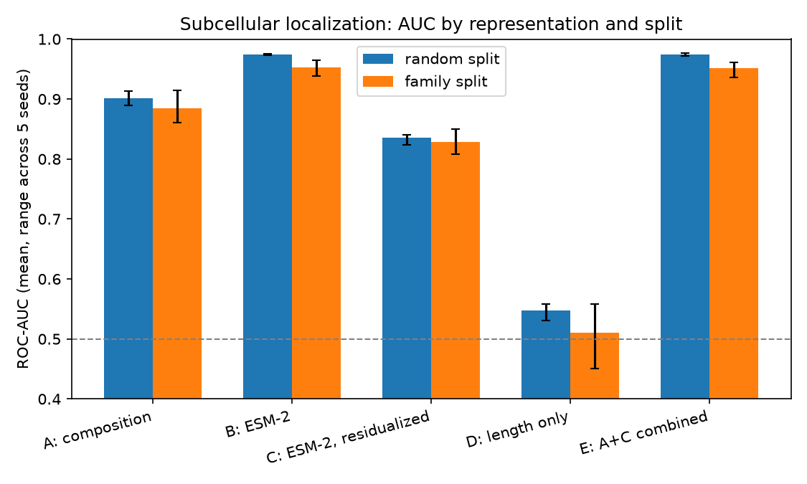
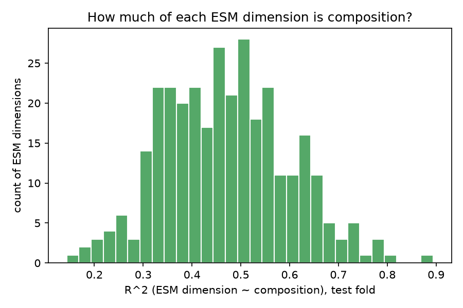

# How much of ESM-2's signal is just amino acid composition?



Removing everything linearly predictable from composition still leaves ESM-2 at 0.836 AUC, well above chance and the length-only floor — and the gap over composition survives a family-aware split.

## Problem

ESM-2 embeddings are widely used as drop-in features for protein classification.
It is rarely checked how much of that performance is amino acid composition, or
family memorization, in disguise. This decomposes ESM-2's signal on a
subcellular localization task along both axes.

## Approach

Five representations, same logistic regression classifier, standardized
features, identical hyperparameters:

- **A — composition**: 20 amino-acid frequencies + log(length), 21 dims.
- **B — ESM-2**: mean-pooled last hidden state of `facebook/esm2_t6_8M_UR50D` (320 dims), excluding special/padding tokens.
- **C — ESM-2 residualized**: 320 ESM dims regressed on the 21 composition features, fit **on the training fold only**, prediction subtracted from both folds (`experiment.py::residualize`).
- **D — length only**: log(length) alone, 1 dim — the trivial-size floor.
- **E — A+C combined** (341 dims): concatenation of A and C, included for reference — see Key finding for why this is not an independent check.

Two split schemes, 5 seeds each: stratified random 80/20, and **group-aware** 80/20 (`GroupShuffleSplit`) by UniProt protein family, so no family straddles train/test. Each (representation, seed) fit gets a bootstrap 95% CI (1000 resamples), used only for the paired-difference comparisons below — the main results table reports [min, max] across the 5 seeds instead, not a CI. All representations score the same test proteins within a seed, so those differences are **paired**, not independent: resample `i` draws the same proteins for every representation, giving `Cov > 0` and a difference CI *narrower* than either marginal — expected, not an error.

## Dataset

Reviewed (SwissProt) human proteins from the UniProt REST API, with subcellular location and protein-family annotation. A protein is kept only if its location annotation mentions exactly one of `Nucleus` or `{Cell membrane, Plasma membrane}` — both or neither is dropped. Sequences: length 50-1022, standard amino acids only, deduplicated on exact sequence.

| step | count |
|---|---|
| raw reviewed human proteins | 20,431 |
| dropped: ambiguous (mentions both) | 321 |
| dropped: neither location mentioned | 11,201 |
| dropped: length / non-standard residues | 1,084 |
| dropped: duplicate sequence | 23 |
| **kept** | **7,802** |
| nucleus / membrane | 4,730 / 3,072 (60.6% / 39.4%) |

Class balance is 61/39; no resampling applied. Full numbers in `results/dataset_stats.csv`.

**Family confound**: `protein_families` groups the 7,802 proteins into 4,393 families (median size 1). The ten largest hold 13.3% of nucleus and 24.0% of membrane proteins (`results/family_top10.csv`) — the GPCR family (662 members) is 100% membrane, the KRAB zinc-finger family (499 members) is 100% nucleus. A random split can put paralogs on both sides, letting a model that recognizes sequence families — which ESM-2 was pretrained to do — score well without learning localization biology.

## Results

Mean ROC-AUC across 5 seeds; **brackets are [min, max] across seeds, not a confidence interval** (`results/representations.csv`):

| representation | random split | family split |
|---|---|---|
| A: composition | 0.901 [0.890, 0.913] | 0.884 [0.861, 0.914] |
| B: ESM-2 | 0.974 [0.973, 0.976] | 0.952 [0.938, 0.965] |
| C: ESM-2, residualized | 0.836 [0.824, 0.841] | 0.829 [0.808, 0.850] |
| D: length only | 0.548 [0.531, 0.558] | 0.511 [0.450, 0.558] |
| E: A+C combined | 0.974 [0.972, 0.977] | 0.952 [0.937, 0.961] |

Paired mean AUC differences; **brackets are bootstrap 95% CIs** (1000 resamples, `results/representation_diffs.csv`):

| comparison | random split | family split |
|---|---|---|
| B − A | 0.073 [0.059, 0.089] | 0.068 [0.049, 0.087] |
| B − C | 0.138 [0.120, 0.157] | 0.123 [0.104, 0.143] |
| C − D | 0.288 [0.252, 0.325] | 0.318 [0.278, 0.358] |

How much does the family split actually constrain (`results/family_stats.csv`)? 53.3% of proteins belong to a family of size ≥2; under the random split, 51.5% of test proteins have a same-family relative in train, which the group-aware split removes. So the family-aware split reshuffles roughly half the dataset, not all of it — the correction only binds on that fraction. Within that limit, the ESM-composition gap (B−A) barely moves between splits and its CI excludes zero in both, so the effect survives. AUC(B) drops under the family split (0.974→0.952), consistent with some family-driven inflation on the random split, but the ranking of all five representations is unchanged.

Secondary analysis — R² of each of the 320 ESM dimensions predicted from composition, fit on train, evaluated on test, random split (`results/residual_r2.csv`): median 0.466, IQR [0.373, 0.556], 40.0% of dimensions above R²=0.5.



## Key finding

Composition alone reaches 0.901 AUC. The composition-*orthogonal* part of ESM-2 (C) reaches 0.836 alone — far above the length-only floor (0.548) and above chance, so real signal survives removing everything linearly predictable from composition.

The criterion was fixed before running: if the residual collapsed toward the length-only floor, the ESM advantage would be compositional; if it stayed high, ESM carries signal that composition does not explain. It stayed high. **ESM-2 carries substantial non-compositional signal on this task.** C=0.836 is a *lower bound* on that signal — residualization removes every linear composition correlate, including genuine localization biology that correlates with composition (transmembrane helices are objectively hydrophobic, itself a composition fact). Whether the rest of C is "new" biology or non-linear composition encoding that a linear regression can't strip out is not something this experiment can tell apart — that needs a non-linear probe, out of scope here. Median per-dimension R²=0.466 says composition explains under half the linear variance of a typical ESM dimension; that the *remaining* half alone still gets 0.836 AUC means it is disproportionately informative for this task, not noise.

E (A+C combined) does not exceed B (0.974 vs 0.974 random, 0.952 vs 0.952 family split). That is expected, not evidence of a clean decomposition: C is B's residual after projecting out A on the training fold, so span(A,C) = span(A,B) exactly, and a linear model fit on [A,C] can represent the same functions as one fit on [A,B] — which trivially contains B itself. E ≥ B holds almost by construction. What the number does show: E does not exceed B, so composition adds nothing beyond ESM-2 — ESM already subsumes the compositional signal, it does not merely sit alongside it.

## Limitations

- Family grouping uses UniProt's curated `protein_families` string, not sequence identity. The stronger test — clustering by sequence identity (e.g. MMseqs2 at 30% identity) and splitting by cluster — was not run, and would catch homology the family string misses (proteins without a listed family, or related but differently-named families).
- Smallest ESM-2 variant only (8M parameters); larger models may encode more.
- Linear probe and linear residualization only: C cannot remove non-linear composition-embedding relationships, so it is a lower, not exact, bound on non-compositional signal (see Key finding).
- Single task (nucleus vs. membrane) and single organism (human).
- UniProt annotation (location and family) is itself partly computational.

## Reproducibility

```
python3 -m venv .venv && source .venv/bin/activate
pip install -r requirements.txt
python run.py
```

Downloads and caches raw UniProt data (`data/raw/`) and ESM-2 embeddings
(`data/embeddings.npz`) on first run; reruns reuse both caches. Full run (cold
cache) takes about 10 minutes on a laptop CPU; with caches warm, under a minute.
Outputs land in `results/` and `figures/`.
